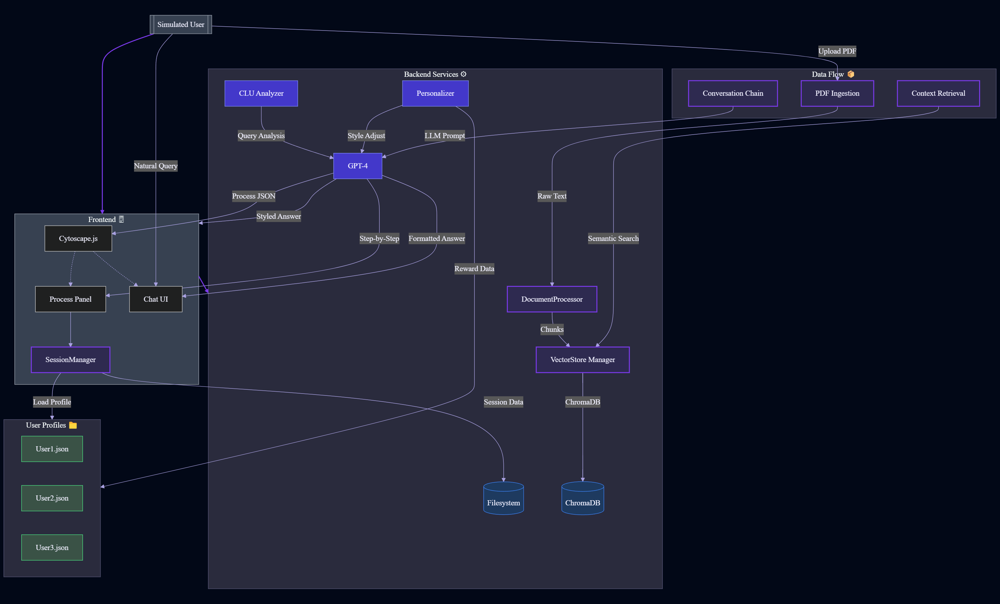
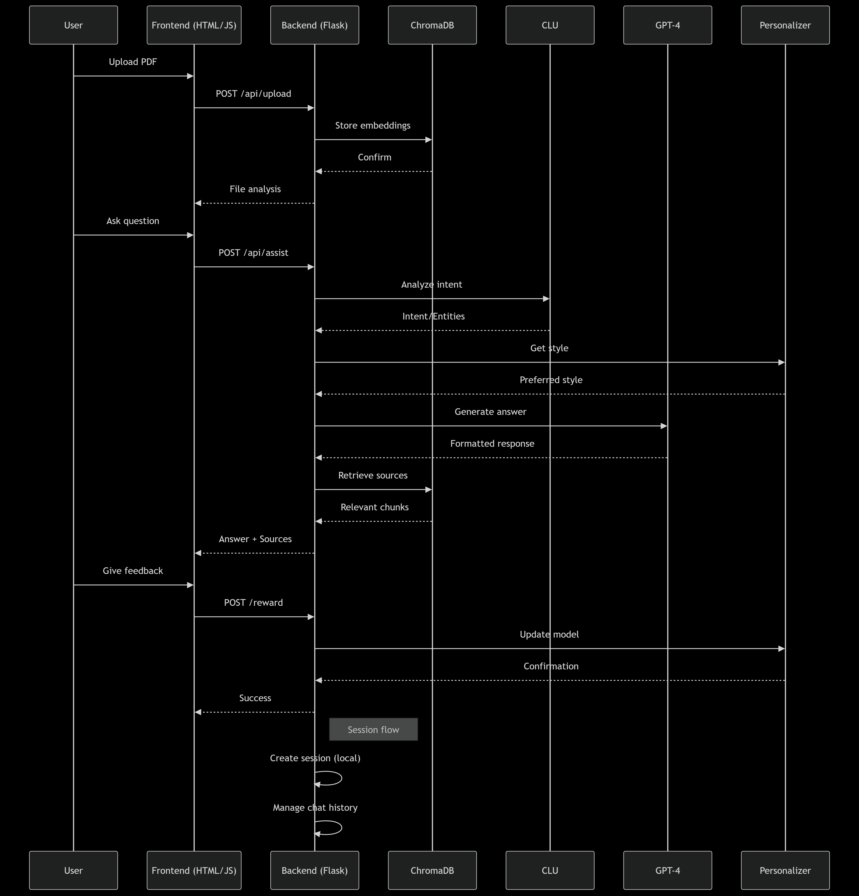
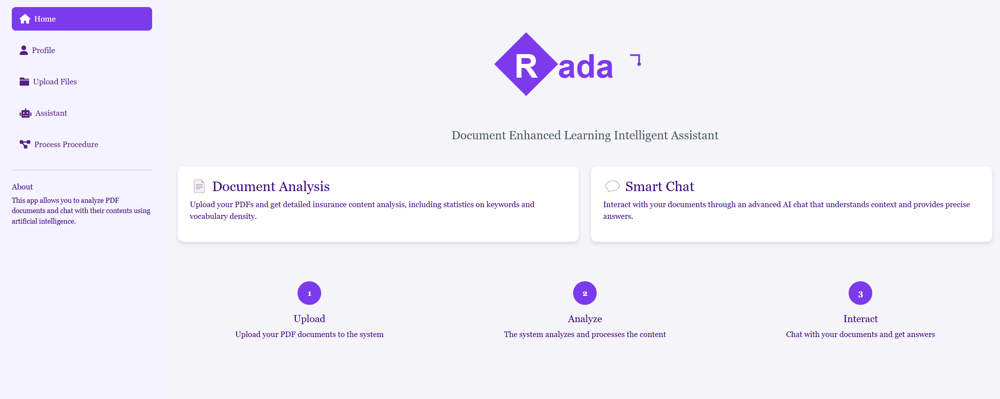
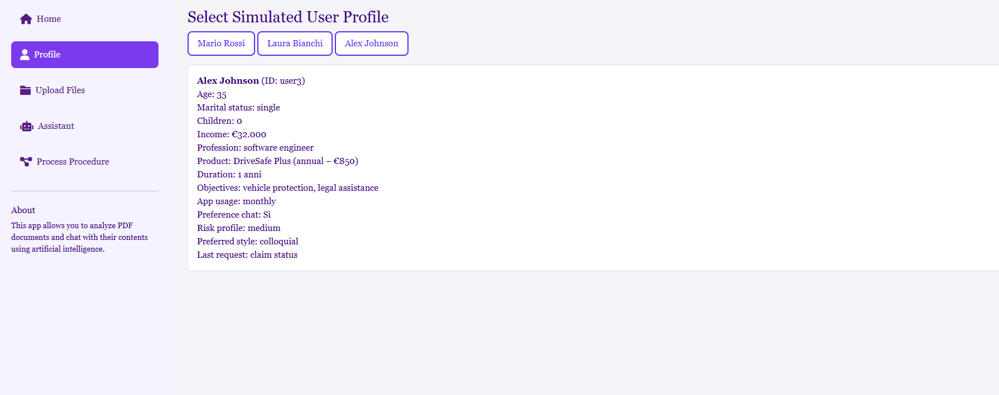
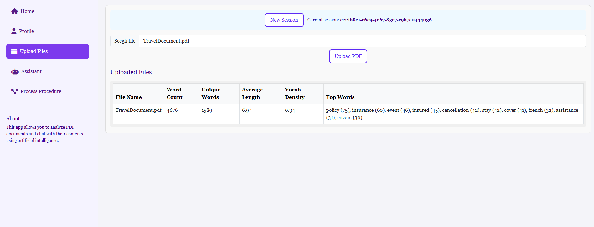
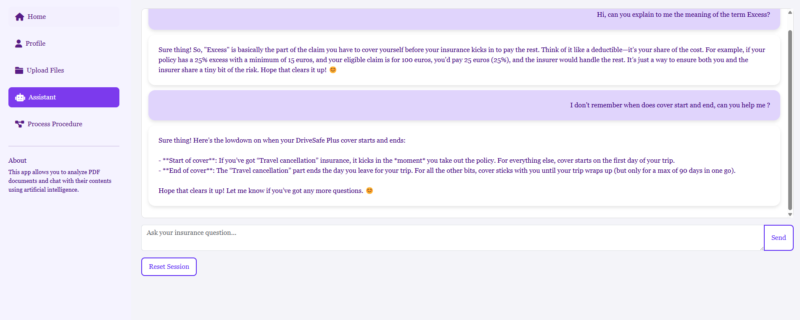
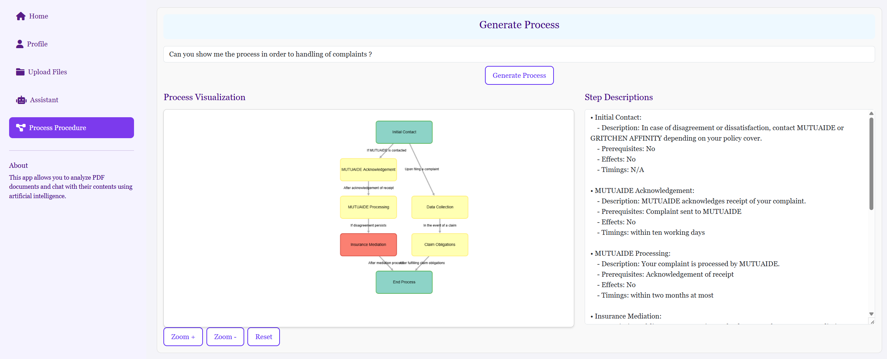

# RADA - Insurance Enhanced Learning Intelligent Assistant

**RADA** is an AI-powered document analysis and conversational assistant designed for the insurance domain. It allows users to upload documents, analyze their content, and interact with them through a natural language interface.

---

## 🚀 Features

- **📄 Document Analysis**: Upload PDF documents and derive in-depth statistics with Azure Embedding Deployment
- **💬 Conversational AI**: Engage in natural-language chat with your documents via Azure OpenAI Assistant
- **🎯 Personalization**: Customize responses using user profiles, powered by Azure Cognitive Search 
- **🔍 Process Extraction**: Leverage Azure Language Understanding to automatically identify and visualize document workflows  

---

## 🧠 Architecture



---

## 🧩 Key Components

- **Frontend**: HTML/JS interface with Bootstrap styling  
- **Backend**: Flask server with REST API endpoints  
- **Vector Database**: [ChromaDB](https://www.trychroma.com/) for document embeddings  
- **AI Services**:  
  - GPT-4 for answer generation  
  - Azure CLU for intent recognition  
  - Local Personalization Engine to adapt responses to user profiles

---

## 📈 Workflow



---

## 💻 Installation

1. **Clone the repository:**

```bash
   git clone https://github.dxc.com/Cloud-ITO/hackathon-2025-policy-gpt-73.git
   cd hackathon-2025-policy-gpt-73
```
2. **Install Python dependencies:**
```bash
pip install -r requirements.txt
```
3. Run the application
```bash
python app.py
```
4. Access the app at http://localhost:5000

****

---
## 📡 API Endpoints

| Endpoint                      | Method | Description                       |
| ----------------------------- | ------ | --------------------------------- |
| `/api/create_session`         | POST   | Creates a new session             |
| `/api/upload`                 | POST   | Uploads a PDF file                |
| `/api/assist`                 | POST   | Answers user questions            |
| `/api/chat`                   | POST   | Conversational chat endpoint      |
| `/api/extract_process`        | POST   | Extracts process from documents   |
| `/api/reset`                  | POST   | Resets a session                  |
---
## 🖼️ Screenshots

### 1. Home Page


### 2. Profile Sections


### 3. Upload PDF Documents


### 4. Chat Interface


### 5. Process Diagram


---

## ⚙️ Configuration
The application requires the following environment variables:

```bash
AZURE_OPENAI_ENDPOINT: Azure OpenAI endpoint
AZURE_OPENAI_API_KEY: Azure OpenAI API key
AZURE_OPENAI_DEPLOYMENT: Deployment name
CLU_ENDPOINT: Azure CLU endpoint
CLU_KEY: Azure CLU key
CLU_PROJECT: CLU project name
CLU_DEPLOYMENT: CLU deployment name
```
