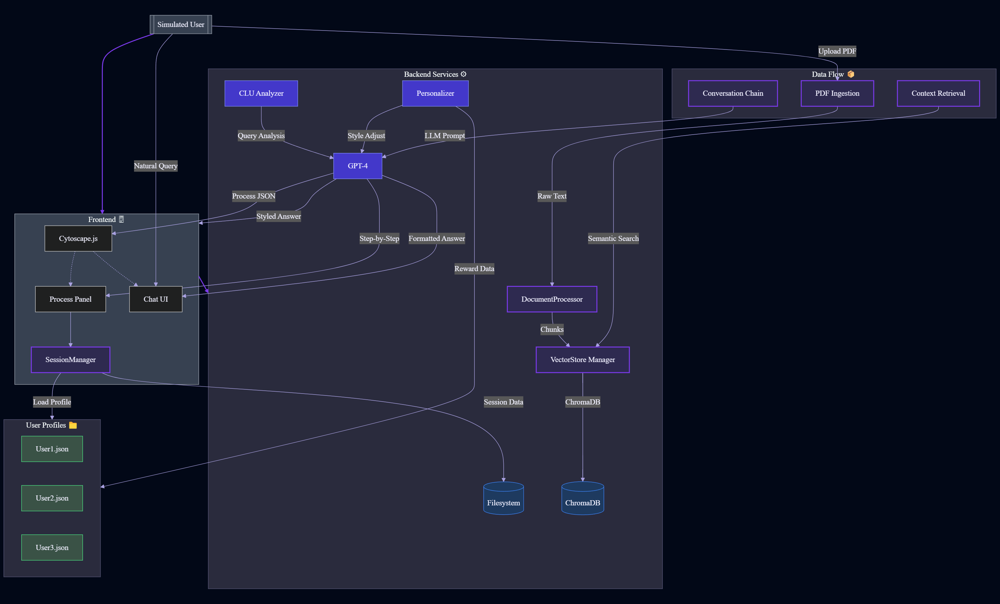
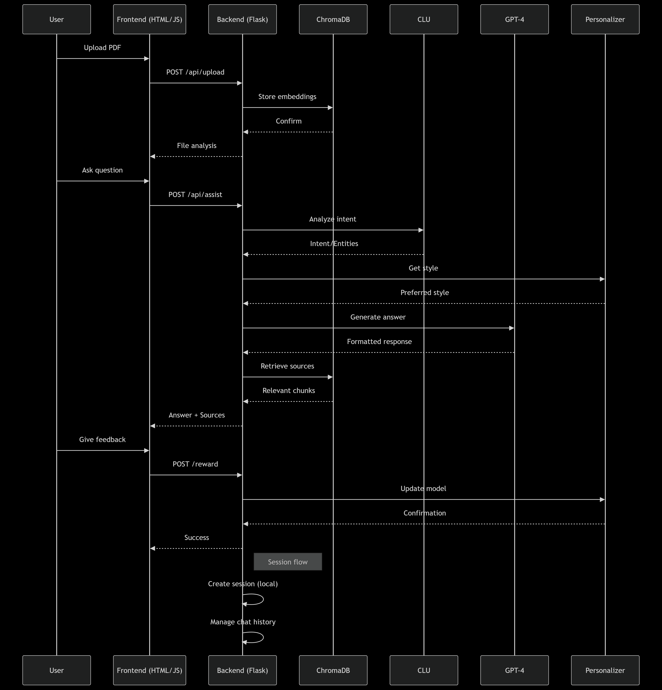

# RADA: Insurance Enhanced Learning Intelligent Assistant

**RADA** is an enterprise-grade Retrieval-Augmented Generation (RAG) system tailored for the insurance sector. It provides an advanced document processing pipeline and a conversational interface, enabling stakeholders to extract actionable insights, analyze policies, and map complex workflows using natural language processing.

---

## Core Capabilities

* **Document Processing Pipeline:** Ingests PDF documents and generates high-dimensional vector embeddings utilizing Azure Embedding models for robust semantic search.
* **Conversational AI Interface:** Facilitates context-aware, natural-language querying against corporate knowledge bases via Azure OpenAI Assistants.
* **Contextual Personalization Engine:** Dynamically tailors AI responses based on specific user profiles and historical interactions, integrated with Azure Cognitive Search.
* **Automated Workflow Extraction:** Employs Azure Conversational Language Understanding (CLU) to identify, extract, and visualize operational processes and intents from unstructured text.

---

## System Architecture



### Technology Stack

* **Presentation Layer:** HTML5 and JavaScript client, utilizing Bootstrap for responsive UI components.
* **Application Layer:** Python Flask server exposing a RESTful API architecture.
* **Data & Persistence Layer:** [ChromaDB](https://www.trychroma.com/) acting as the local vector store for document embeddings and semantic retrieval.
* **Cognitive Services Integration:**
    * **LLM Engine:** GPT-4 (via Azure OpenAI) for generative responses and reasoning.
    * **Intent Recognition:** Azure CLU for semantic parsing and process extraction.
    * **Personalization:** Custom local engine bridging user metadata with cognitive search results.

---

## Execution Workflow



---

## Local Development Setup

To provision the application locally, ensure Python 3.8+ is installed on your environment.

**1. Clone the repository:**
```bash
git clone [https://github.dxc.com/Cloud-ITO/hackathon-2025-policy-gpt-73.git](https://github.dxc.com/Cloud-ITO/hackathon-2025-policy-gpt-73.git)
cd hackathon-2025-policy-gpt-73

```

**2. Install dependencies:**
It is recommended to use a virtual environment (e.g., `venv` or `conda`).

```bash
pip install -r requirements.txt

```

**3. Initialize the application:**

```bash
python app.py

```

**4. Access the client:**
Navigate to `http://localhost:5000` in your web browser.

---

## REST API Reference

The backend exposes the following endpoints for client-server communication. All POST requests expect a standard JSON payload unless multipart form data is required (e.g., file uploads).

| Endpoint | HTTP Method | Description |
| --- | --- | --- |
| `/api/create_session` | POST | Initializes a new stateful interaction session. |
| `/api/upload` | POST | Ingests a PDF file, triggers the embedding pipeline, and stores vectors. |
| `/api/assist` | POST | Processes user queries against the document context and returns an answer. |
| `/api/chat` | POST | Handles multi-turn conversational interactions, maintaining context. |
| `/api/extract_process` | POST | Analyzes document content to map and output sequential business workflows. |
| `/api/reset` | POST | Clears the current session state and contextual memory. |

---

## UI Components Overview

The application interface is divided into the following functional modules:

1. **Home Page:** `docs/home.png`
2. **Profile Management:** `docs/profile.png`
3. **Document Ingestion Module:** `docs/upload.png`
4. **Conversational Interface:** `docs/chat.png`
5. **Workflow Visualization:** `docs/diagram.png`

---

## Environment Configuration

Deployment requires the following environment variables to be explicitly defined. Create a `.env` file in the root directory before execution:

```env
# Azure OpenAI Configuration
AZURE_OPENAI_ENDPOINT="<your_azure_openai_endpoint>"
AZURE_OPENAI_API_KEY="<your_azure_openai_api_key>"
AZURE_OPENAI_DEPLOYMENT="<your_model_deployment_name>"

# Azure Cognitive Language Understanding (CLU) Configuration
CLU_ENDPOINT="<your_clu_endpoint>"
CLU_KEY="<your_clu_key>"
CLU_PROJECT="<your_clu_project_name>"
CLU_DEPLOYMENT="<your_clu_deployment_name>"

```

```

```
